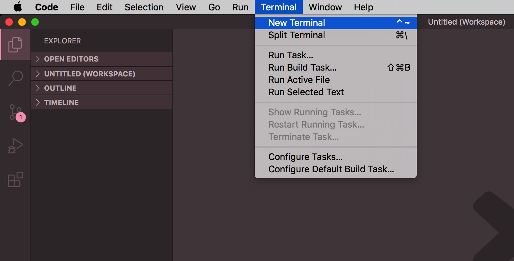
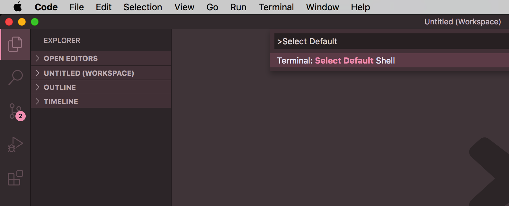
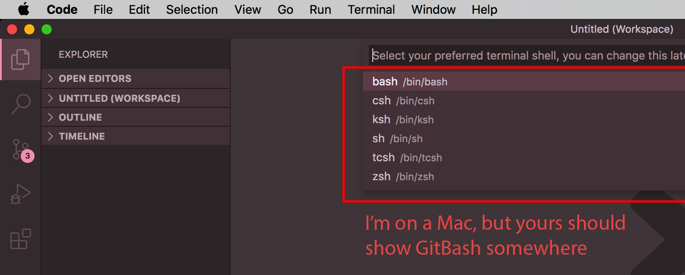
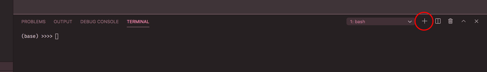

# Setup
(Open any links in a new tab to keep this visible)

Hey man! Before we have fun, we just have to do some ugly setup stuff. It's usually a one-time thing though, once you're set up you're good to go. 

### We need: **Git**, and a **code editor**. If you're on a Mac or Linux, you also need **Homebrew**.

### What Is Git?
*Git* tracks changes made to our code and allows you to *push* those changes to the repository (or 'repo') which is the GitHub link up in the address bar above. From there, I *pull* (or download) those changes to my machine. Then I make my changes/additions and *push* my code to the repo as well. You *pull* those changes, and the cycle just keeps going, pushing and pulling. It's mean as hell when you think about it. There's a lot more it can do, but that's the main idea.

## Download Links

### Windows

You need **GitBash** which comes with a Linux terminal *and* Git. 
Just make sure to get the correct installer (32-bit or 64-bit depending on your computer's operating system.)

[Windows: GitBash (comes with Git)](https://github.com/git-for-windows/git/releases/tag/v2.27.0.windows.1)

### Code Editor
You'll also need a good code editor. You may already have one, but if not I **highly** recommend **[Visual Studio Code](https://code.visualstudio.com/)**. If you decide to install and run it, click on the **Extensions button** on the far left and type in "Python" and install the first one that pops up (Python by Microsoft)

### Terminal Setup (for Visual Studio Code only)
If you decide to use Visual Studio Code, we need to tell it we want to use the GitBash terminal *rather than* the traditional Windows Command Line Prompt (which is awful btw.)

1. Open Visual Studio Code (close all projects, nothing should be open)

2. Click "Terminal" > "New Terminal" up top in the menu bar

3. Open the command palette using Ctrl + Shift + P.

4. Start typing "Select Default Shell" and choose it when it appears

5. Select Git Bash from the options

6. Click on the + icon in the terminal window.

7. The new terminal now will be a Git Bash terminal. Give it a few seconds to load Git Bash (may have to restart VSCode)

Even if you don't *have* to restart VSCode, I would restart it anyway so you can make sure it works. Restart it, click "Terminal" > "New Terminal", and see if the terminal looks different now (should have green, purple, & yellow colors)

# Now What?
At this point, call me when we both have some free time, I usually get home around 5pm-ish during the week and 1pm on Saturdays. I'm off on Sundays for now.

If you don't already know some terminal commands, we'll have to learn a few. They're dead simple and easy to use, and you'll use them **a lot** so no worries! If you want to learn some before we chat,

[Here's an awesome cheat sheet for Linux terminal commands](https://www.linuxtrainingacademy.com/linux-commands-cheat-sheet/)

Read #5 and #15. As long as you know how to change directories, create, move, copy, and delete files/folders. That's the main takeaway.

### WARNING
Just be VERY careful, Linux commands are *not* reversible. There's no undo or Ctrl+Z lol! If you delete a file or folder, it's permanently gone, so just be careful. I would just make a practice folder on your computer somewhere and practice making files, folders, deleting those, etc. in *that* folder. Just make sure to never do it on one of your computer's folders until you are more comfortable.

# Awesome Resources

### Git Resources
* [Git Detailed Reference](http://git.github.io/git-reference/) (My favorite)
* [Git Quick Reference](https://www.dataschool.io/git-quick-reference-for-beginners/) (Good for anyone, not just beginners)

### Linux Terminal Resources
* [Linux Terminal Commands](https://www.linuxtrainingacademy.com/linux-commands-cheat-sheet/)